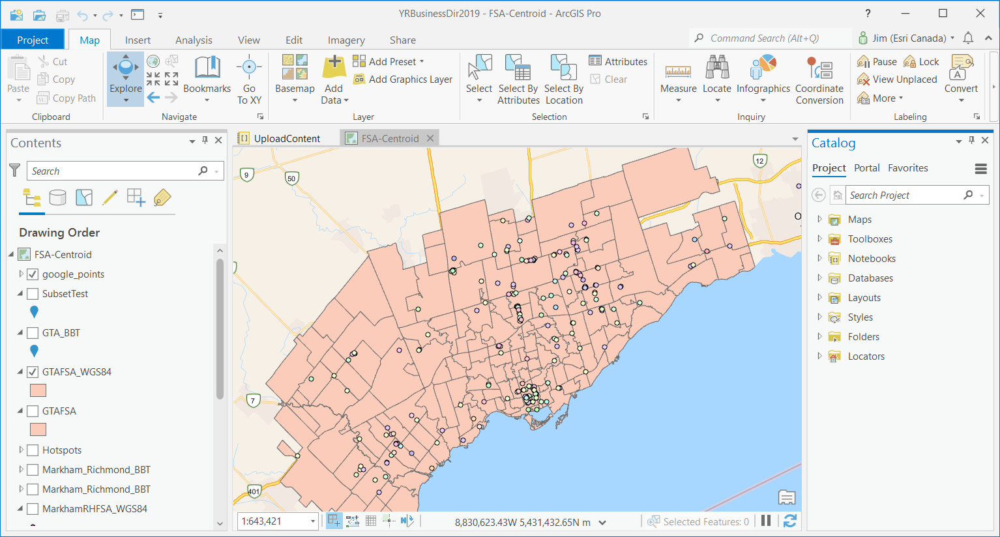

# Google API ArcGIS Integration

This project makes use of the Google Maps API and leverages ArcGIS technology for analysis. This project works by making a series of Google API Nearby Location calls and converts the JSON response into a CSV file. Using the Forward Sorting Stations for the Greater Toronto Area, a list of Longitude and Latitude were passed into the Google API using ArcPy. Depending on the user input, one may choose to look for a specific category of places such as bubble tea restaurants, hospitals, or police stations. 

### [See my results here using my ArcGIS Online Application](https://arcg.is/1Cy4L50)

***Disclaimer:*** This project has been created for interest, the script is to be used at your own risk. [Drop me a line](https://www.linkedin.com/in/jimwei/) if you want to get in touch!